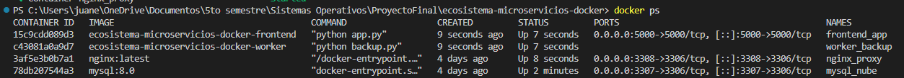
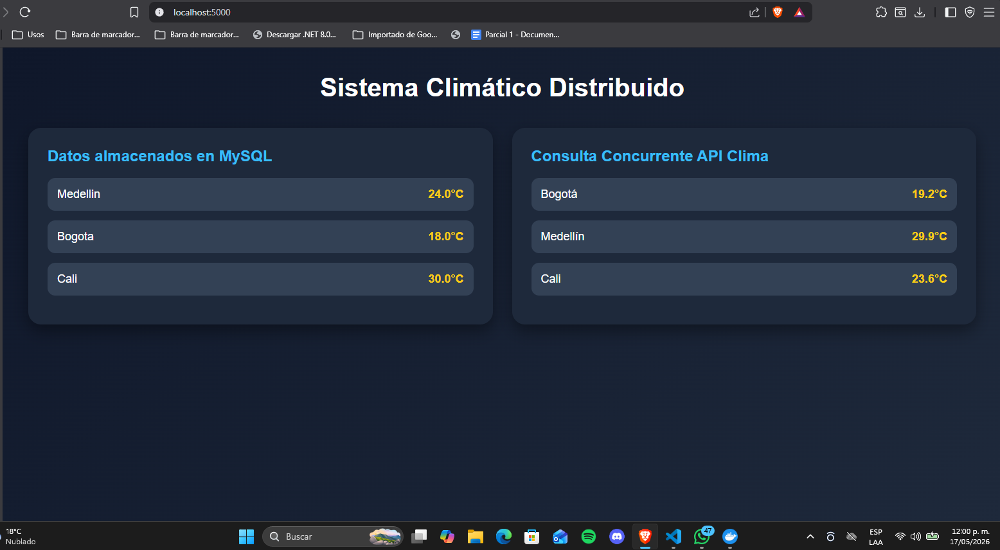
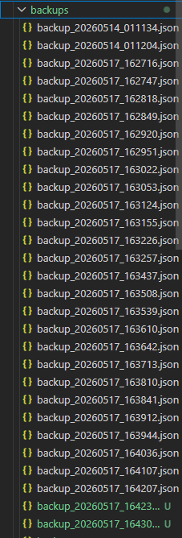
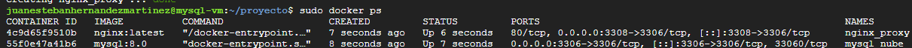

# Ecosistema de Microservicios Distribuidos con Docker

Proyecto final de Sistemas Operativos.

---

# Integrantes

- Juan Esteban Giraldo
- Juan Esteban Hernández
- Juan Jacobo Cañas

---

# Descripción del Proyecto

Este proyecto implementa un ecosistema de microservicios distribuidos utilizando Docker y Docker Compose, simulando una arquitectura híbrida entre nube y entorno local.

El sistema está compuesto por:

- Un contenedor MySQL con Nginx como proxy.
- Un contenedor Worker encargado de realizar backups automáticos.
- Un contenedor Frontend desarrollado con Flask.
- Comunicación entre contenedores mediante Docker Networks.
- Persistencia mediante Docker Volumes.
- Implementación de concurrencia usando AsyncIO.

---

# Arquitectura del Sistema

                ┌──────────────────┐
                │   Frontend Flask │
                │  (Contenedor 3)  │
                └────────┬─────────┘
                         │
                         ▼
                ┌──────────────────┐
                │   Nginx Proxy    │
                │  (Contenedor 1)  │
                └────────┬─────────┘
                         │
                         ▼
                ┌──────────────────┐
                │      MySQL       │
                │  (Contenedor 1)  │
                └────────┬─────────┘
                         │
                         ▼
                ┌──────────────────┐
                │ Worker Backup    │
                │ (Contenedor 2)   │
                └──────────────────┘
```

---

# Tecnologías Utilizadas

| Tecnología | Uso |
|------------|-------------|
| Docker | Contenedores |
| Docker Compose | Orquestación |
| Python | Backend |
| Flask | Frontend/API |
| MySQL | Base de datos |
| Nginx | Proxy TCP |
| AsyncIO | Concurrencia |
| aiohttp | Requests asíncronos |
| HTML/CSS | Interfaz gráfica |

---

# Estructura del Proyecto

ecosistema-microservicios-docker/
│
├── frontend/
│   ├── app/
│   │   ├── app.py
│   │   └── templates/
│   │       └── index.html
│   ├── Dockerfile
│   └── requirements.txt
│
├── worker/
│   ├── backup.py
│   ├── Dockerfile
│   └── requirements.txt
│
├── nginx/
│   └── nginx.conf
│
├── mysql/
│   └── init.sql
│
├── backups/
│
├── docker-compose.yml
│
├── .env
│
└── README.md
```

---

# Requisitos Previos

Antes de ejecutar el proyecto es necesario tener instalado:

- Docker Desktop
- Docker Compose
- Git

---

# Configuración del Proyecto

## 1. Clonar repositorio

```bash
git clone https://github.com/JuanHernan88/ecosistema-microservicios-docker.git

cd ecosistema-microservicios-docker
```

---

## 2. Configurar variables de entorno

Crear archivo `.env`:

```env
MYSQL_ROOT_PASSWORD=root123
MYSQL_DATABASE=clima_db
MYSQL_USER=usuario_app
MYSQL_PASSWORD=app123
```

---

## 3. Ejecutar contenedores

```bash
docker compose up -d --build
```

---

## 4. Verificar contenedores

```bash
docker ps
```

Deben aparecer:

```text
mysql_nube
nginx_proxy
worker_backup
frontend_app
```

---

## 5. Abrir aplicación

Abrir navegador:

```text
http://localhost:5000
```

---

# Funcionalidades Implementadas

## Contenedor 1 — MySQL + Nginx

### Características

- Base de datos MySQL.
- Persistencia mediante Docker Volumes.
- Usuario seguro.
- Proxy TCP usando Nginx.
- Comunicación mediante Docker Networks.

### Persistencia

Los datos permanecen incluso después de reiniciar contenedores.

---

## Contenedor 2 — Worker Backup

### Funcionalidades

- Conexión automática a MySQL.
- Generación de backups periódicos.
- Almacenamiento persistente en JSON.
- Automatización usando bucle infinito con `sleep`.

### Evidencia

Los backups se almacenan en:

```text
backups/
```

Ejemplo:

```text
backup_20260514_011134.json
```

---

## Contenedor 3 — Frontend/API

### Funcionalidades

- Interfaz web desarrollada en Flask.
- Consulta de datos almacenados en MySQL.
- Consulta concurrente de API pública.
- Dashboard climático responsive.

---

# Implementación de Concurrencia

La concurrencia fue implementada utilizando:

- `AsyncIO`
- `aiohttp`

## Justificación

Se eligió concurrencia asíncrona debido a que las consultas a APIs externas son tareas I/O-bound.

El uso de `asyncio.gather()` permite ejecutar múltiples requests simultáneamente sin bloquear el hilo principal.

## Fragmento clave

```python
resultados = await asyncio.gather(*tareas)
```

---

# Redes Docker

El proyecto utiliza una red personalizada:

```yaml
networks:
  red_microservicios:
```

Esto permite:

- Comunicación entre contenedores.
- Resolución DNS interna.
- Acceso usando nombres de servicio.

Ejemplo:

```python
host="nginx"
```

---

# Dockerfiles Optimizados

Se utilizaron imágenes ligeras:

```dockerfile
FROM python:3.12-slim
```

Esto reduce:
- tamaño de imagen,
- consumo de recursos,
- tiempo de despliegue.

---

# Límites de Recursos

El frontend se ejecuta con:

- 2 vCPUs
- 2 GB RAM

Configurado en:

```yaml
deploy:
  resources:
    limits:
      cpus: "2.0"
      memory: 2G
```

---

# Persistencia de Datos

## MySQL

```yaml
volumes:
  - mysql_data:/var/lib/mysql
```

## Backups

```yaml
volumes:
  - ./backups:/app/backups
```

---

# Evidencias 

## Contenedores funcionando



# Frontend funcionando



# Backups automáticos



#Contenedores en VM de GCP



---

# Comandos Útiles

## Levantar contenedores

```bash
docker compose up -d --build
```

## Detener contenedores

```bash
docker compose down
```

## Ver logs

```bash
docker logs worker_backup
```

## Ver backups

```bash
ls backups
```

---